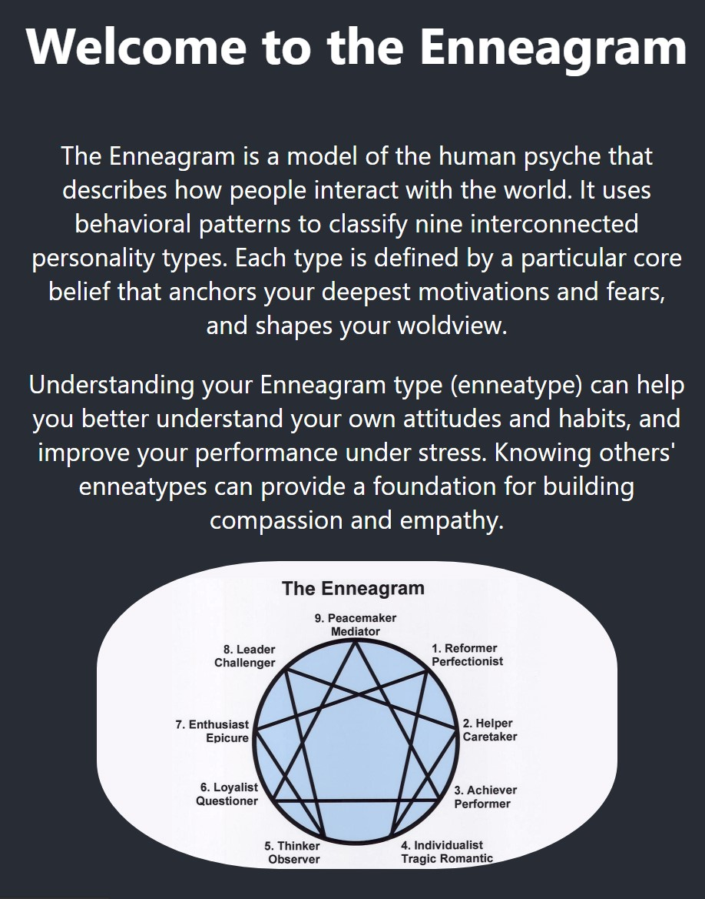
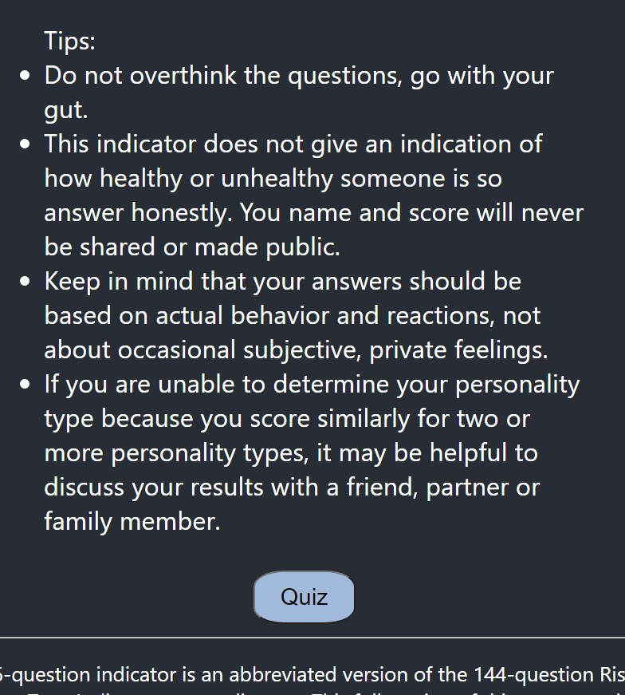
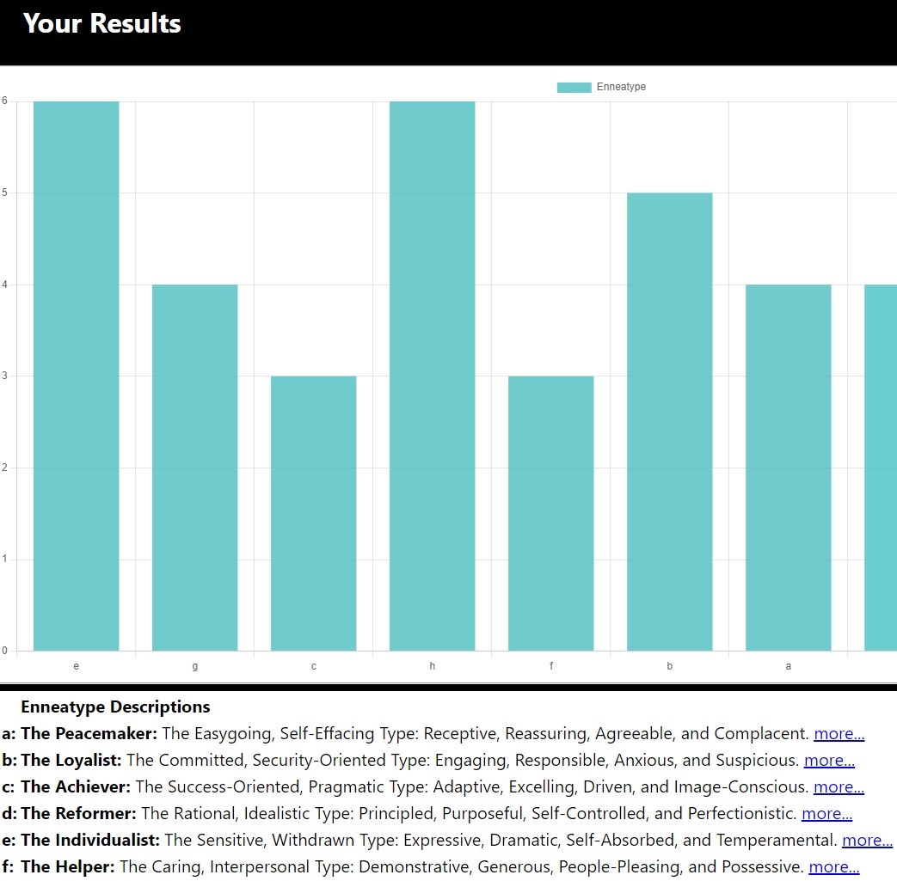
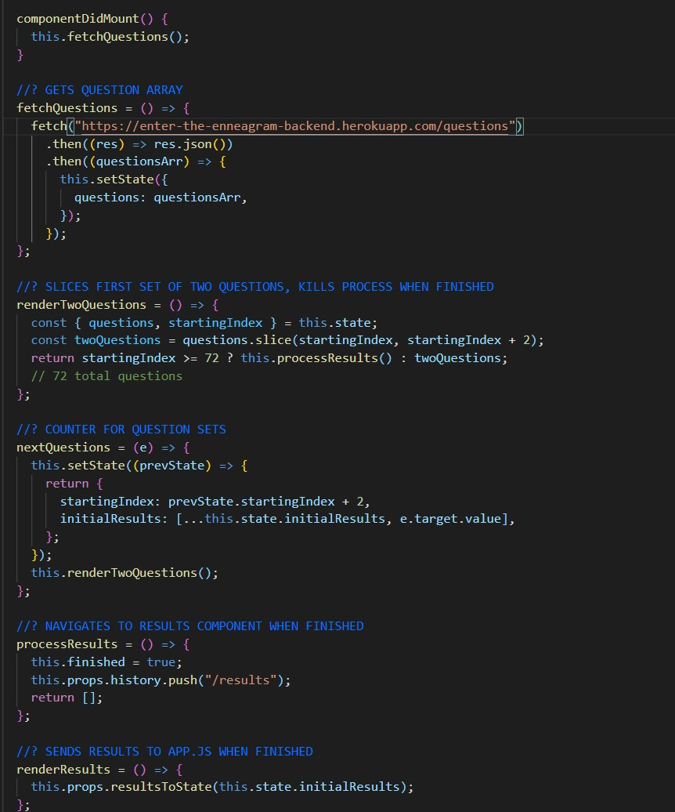

# Enter the Enneagram! 


See the working app and [discover your Enneatype!](https://enter-the-enneagram.herokuapp.com/)

 
<p align="center">

</p>

## Description

This app uses React, HTML and CSS on the frontend and JSON server to provide a simple, RESTful backend. 

Please note that this repository contains the frontend for Enter the Enneagram. [The  backend can be found here.](https://github.com/bfreed76/Enter-the_Enneagram_Backend)


### Built Using

[](https://reactjs.org/) [](https://reactrouter.com/)  

<p align="center">

</p>

<!-- CONTACT -->
## Contact Me

[](https://www.linkedin.com/in/brintonfoyreed/) [](https://www.instagram.com/nigels_vacation/) [](https://brintonfoyreed.medium.com/)[ ](mailto:brintonfoyreed@gmail.com)

Project Link: [Enter the Enneagram](https://enter-the-enneagram.herokuapp.com/)

<a href="https://github.com/bfreed76">
<strong>See more apps on my profile page »</strong></a>

<p align="center">

</p>

## To start Enter the Enneagram locally

Start the frontend React server in the root directory terminal:
```
npm start
```
Please note that all quiz questions are provided from a json server on the backend, which must be initialized separately. 

[Follow backend setup instructions here.](https://github.com/bfreed76/Enter-the_Enneagram_Backend)

## Requirements

- NodeJS (v14 or higher) and NPM
- chart.js 3.3.0 or higher
- react-chartjs-2: 3.0.3 or higher

See Environment Setup below for instructions on installing these tools if you
don't already have them.

## Environment Setup

<p align="center">

</p>

### Install NodeJS

Verify you are running a recent version of Node with:

```sh
node -v
```

If your Node version is less than 14, update it with:

```sh
nvm install node
```

You can also update your npm version with:

```sh
npm i -g npm
```

### Install React-Chartjs-2 library with peer dependencies:

```bash
npm install --save react-chartjs-2 chart.js
```

We recommend using `chart.js@^3.0.0`.

Then, import and use individual components:

```jsx
import { Doughnut } from 'react-chartjs-2';

<Doughnut data={...} />
```

#### Examples

Please see [live examples](https://reactchartjs.github.io/react-chartjs-2/) or their [source code](example).

<p align="center">

</p>

## Please note that this repository contains the frontend for Enter the Enneagram. [The backend can be found here.](https://github.com/bfreed76/Enter-the_Enneagram_Backend)